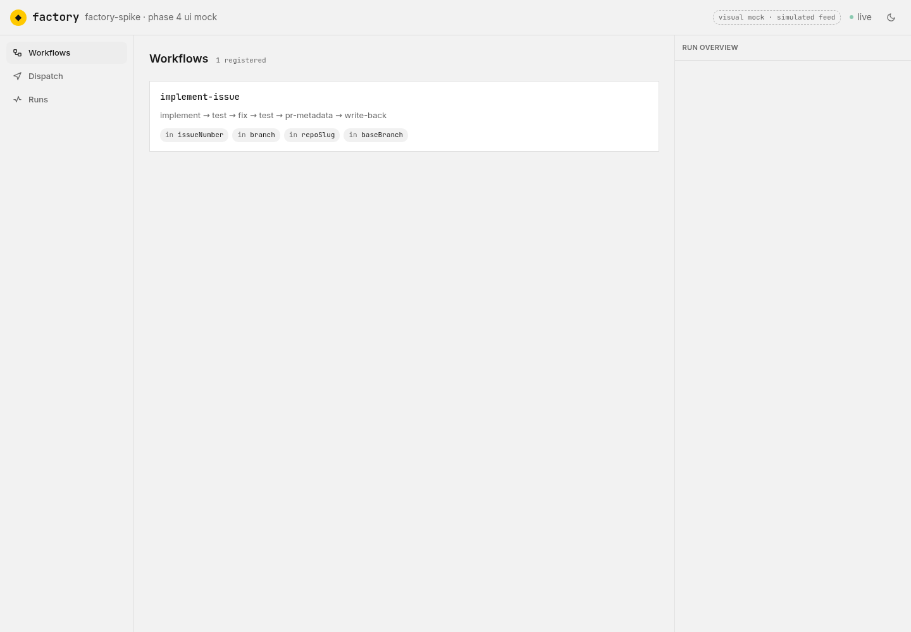
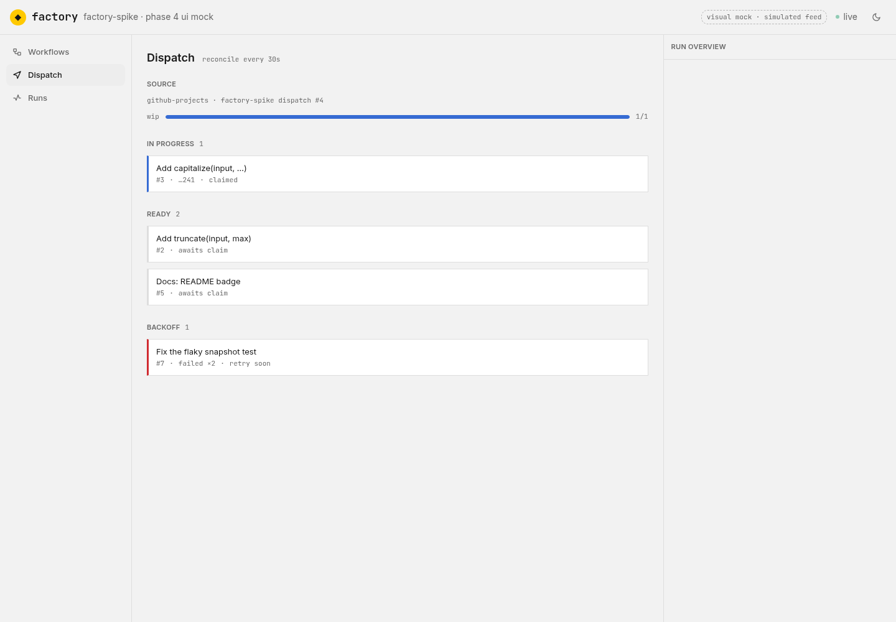
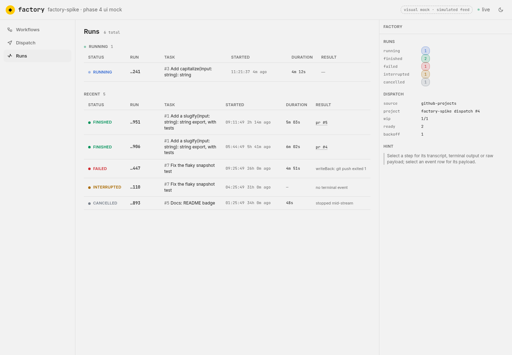
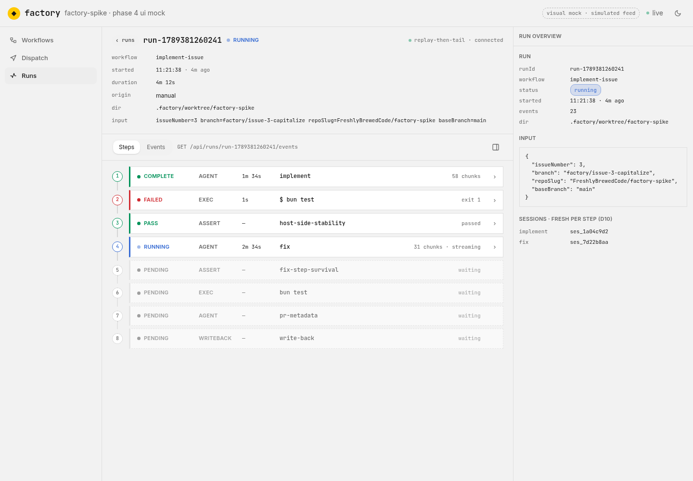
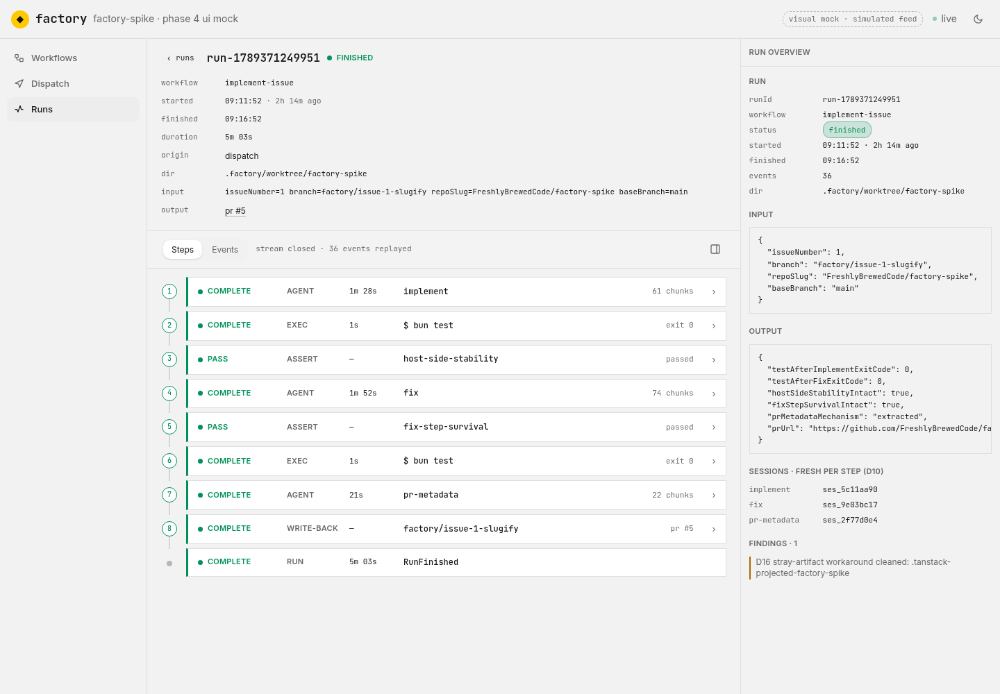
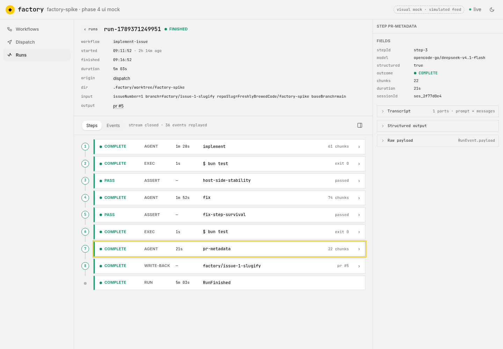
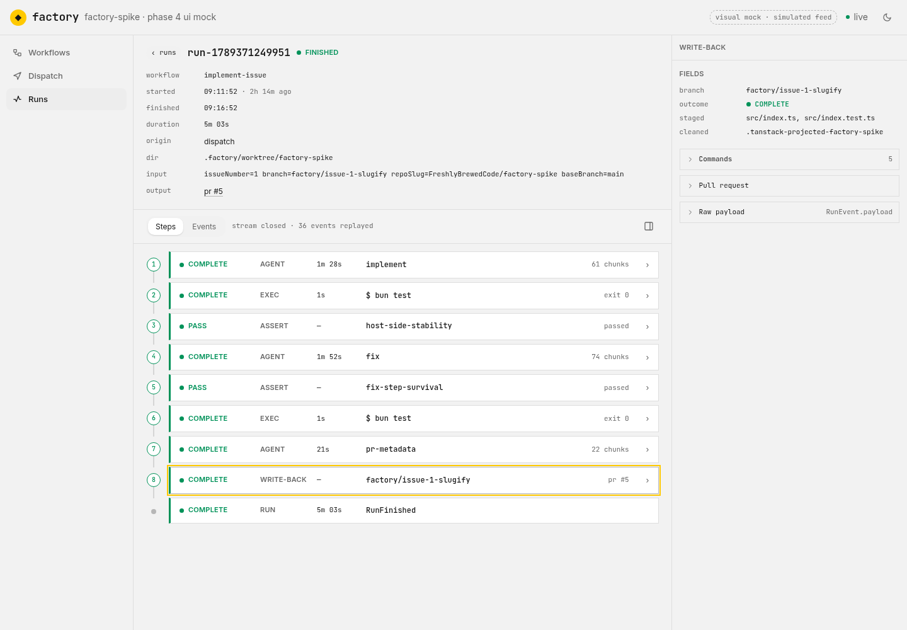
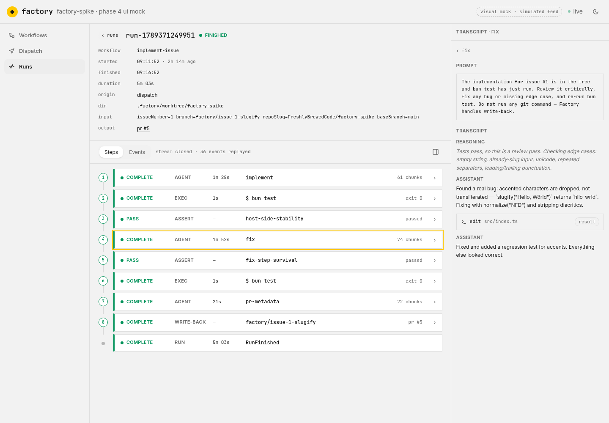
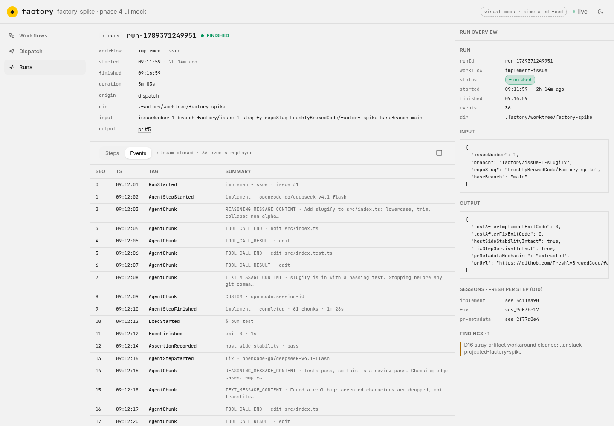

# Finding 7 — phase 4 UI prototype refinement

**Date:** 2026-09-14
**Artifact:** `prototypes/phase4-ui/index.html` — throwaway mock, no backend, simulated live feed
**Status:** one refinement pass done; still not the phase 4 SPA and carries none of the stack
**Screenshots:** [`./7-phase4-ui-prototype-refinement/`](./7-phase4-ui-prototype-refinement/) — captured with `playwright-cli` through the Nix dev shell at 1440×1000, light theme, against the frozen mock (`setInterval`s cleared so the simulated feed doesn't advance mid-shot)

## What this is

A single-session UI/UX refinement of the visual mock, driven by one standing complaint: too much
information on screen at once. Worked section by section (nav → runs → run detail → steps →
details panel). Every change is presentation-only; the mock's shapes still mirror `RunSummary`
and the `RunEvent` payloads.

## Adjustments

- **Nav** — replaced the rail that showed workflows + dispatch + runs as live info with a plain
  three-item menu (Workflows / Dispatch / Runs); each category is now its own page in the main area.
- **Runs page** — replaced the Kanban board with a chronological table: running runs in their own
  group at the top (pulsing dot, live duration), all terminal runs below, newest first. Columns:
  status / run / task / started / duration / result.
- **Run detail** — removed the pipeline/graph strip. The header's chips became one stacked meta
  table (workflow, started, finished, duration, origin, dir, input, output, note). Two tabs remain:
  Steps and Events.
- **Steps list** — compact rows reusing the runs page's status language (dot + label; pulse for
  running) plus kind, duration, name and a right-hand descriptor.
- **Indexed spine** — numbered nodes 1..N down the left, solid connector between real steps, dotted
  and greyed for pending steps; the terminal row ends the spine with a plain dot.
- **Time** — the step's duration moved out of the right-hand meta into its own column, third, right
  after the step type; live-ticking for the running step, `—` where none is recorded.
- **Details panel** — the `Fields` summary stays; every section below it is a collapsed-by-default
  disclosure, using the same bordered summary/body element the transcript uses for tool calls.
- **Transcript** — not a disclosure: clicking it fills the whole panel with the transcript, the
  step's original prompt at the top, and a back control.

## Screenshots

The refined states, in the order the adjustments above were made. All are the light theme,
which is the mock's default in a light-preferring browser and reads best in this document.

**Nav is a category switcher, each category its own page** (`07`, `08`) — the old rail's live
workflow/dispatch/run info no longer sits beside the content.

**Runs page is a chronological table** (`01`) — running runs in their own group at the top, all
terminal runs below, newest first.

**Run detail leads with the ordered steps** (`02`) — the pipeline strip is gone, the header is one
stacked meta table, and Steps/Events remain the two tabs. The running run shows the live spine:
solid connectors between real steps, dotted and greyed nodes 5–8 for pending steps, the running
step pulsing, and a dedicated third time column right after the step kind (1m 34s / 2m 34s).

**Finished run** (`03`) — every step terminal, the spine capped by a plain terminal dot for the
"run" row.

**Details panel is progressive** (`04`, `05`) — `Fields` stays, everything below it is a
collapsed-by-default disclosure using the transcript's own tool-call element (Transcript /
Structured output / Raw payload; Commands / Pull request for write-back).

**Transcript is not a disclosure** (`06`) — clicking it fills the whole panel with the step's
original prompt followed by the message stream, with a back control.

**Not refined** (`09`) — the Events tab was left as it was and is captured only as context for the
tab bar described under "Run detail".

## Decisions taken

- Nav is a category switcher, not a live dashboard — live data belongs on the page it belongs to.
- Runs are read chronologically, not grouped into status columns; "running" is both a separate
  group and a clear in-flight indicator, not a lane on the board.
- Run detail leads with the ordered steps; the graph/pipeline was overloaded and is removed for now.
- Step detail is progressive: summary row → step fields → disclosures → full-panel transcript.
- Collapsible sections reuse the transcript's tool-call element rather than introducing a new one.
- Status-only colour and wayful's achromatic instrument-panel language are preserved; the status
  visual language is shared between the runs page and the steps list.

## Bug found and fixed

- Agent and write-back activities carry status `"completed"`, which was absent from the
  `[data-status]` → colour mapping, so those steps rendered colourless. Added `completed` alongside
  `complete`/`finished`.

## Not covered

- No backend and no real SSE — the feed is still simulated, and `@tanstack/ai-event-client` (D20's
  bet for run detail) remains untested.
- The inspector's run-overview sections and the Events table were left as they were.
